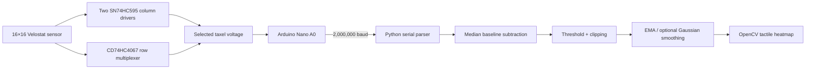

# Low-Cost 16×16 Flexible Tactile Sensor

**Hardware reproduction, sensor fabrication, and real-time tactile visualization**

<p align="center">
  
</p>

<p align="center">
  <em>Figure 1. Finished 16×16 flexible tactile sensor prototype and Arduino-based readout board.</em>
</p>

## Overview

This repository documents a graduation-project reproduction and experimental adaptation of a low-cost 16×16 flexible piezoresistive tactile sensor. The prototype combines a handmade Velostat sensing matrix, an Arduino-based scanning board, and a Python/OpenCV visualization program.

The reference firmware and reading-board architecture are based on the open-source **3D-ViTac** project by Binghao Huang and collaborators. This repository focuses on the complete engineering workflow: sensor fabrication, hardware integration, schematic redrawing, software adaptation, and bench-top evaluation.

## Project contributions

- Fabricated a handmade 16×16 Velostat tactile array with orthogonal electrodes.
- Integrated the sensor with an Arduino Nano, CD74HC4067 multiplexer, and two SN74HC595 shift registers.
- Redrew and documented the sensor-reading schematic in JLCEDA.
- Organized PCB manufacturing files, BOMs, and pick-and-place data.
- Refactored the Python visualization pipeline with validated frame parsing, configurable ports, simulation mode, and clean shutdown.
- Evaluated baseline response, contact localization, spatial response, and an approximate applied-pressure range.

See [Attribution and scope of contribution](docs/attribution.md) for the distinction between upstream work and project work.

## System architecture



## Prototype specifications

| Item | Prototype value |
|---|---|
| Sensor array | 16 × 16 taxels |
| Sensing material | Velostat|
| Target sensor size | approximately 50 mm × 50 mm |
| Electrode pitch | approximately 3.125 mm |
| Microcontroller | Arduino Nano |
| Row selection | CD74HC4067 |
| Column selection | 2 × SN74HC595 |
| ADC transmission | 10-bit ADC reduced to 8-bit values |
| Serial baud rate | 2,000,000 |
| Reported experimental response range | approximately 7.07–47.88 kPa |
| Reported effective spatial response | approximately 3.6 mm × 3.6 mm |

The last two values are observations under the reported prototype setup, not standardized certification results. See [Experiments](docs/experiments.md) and [Limitations](docs/limitations.md).

## Repository structure

```text
.
├── assets/                       # Project photographs and experiment images
├── docs/                         # Fabrication, experiments, limitations, attribution
├── firmware/                     # Arduino matrix-scanning firmware
├── hardware/
│   ├── bom/                      # Readable BOMs and material list
│   ├── manufacturing/            # Gerber and pick-and-place files
│   └── schematics/               # Redrawn reading-board schematic
├── software/                     # Refactored and legacy Python visualizers
├── tests/                        # Parser and processing tests
└── LICENSES/                     # Upstream license and licensing notes
```

## Quick start

### 1. Upload the firmware

Open `firmware/tactile_sensor_reader.ino` in the Arduino IDE, select the appropriate Arduino Nano board and serial port, and upload it.

The inherited scan sequence has a possible column-alignment issue that should be checked on physical hardware. Read [firmware/README.md](firmware/README.md) before quantitative use.

### 2. Install the visualization software

```bash
python -m venv .venv
# Windows: .venv\Scripts\activate
# Linux/macOS: source .venv/bin/activate
pip install -r software/requirements.txt
```

### 3. Run with the sensor

```bash
python software/tactile_visualizer.py --port COM5
# Linux example:
python software/tactile_visualizer.py --port /dev/ttyUSB0
```

Keep the sensor unloaded during the initial baseline collection.

### 4. Run without hardware

```bash
python software/tactile_visualizer.py --simulate
```

The simulation mode generates a moving synthetic contact pattern, making it possible to verify the software environment without the sensor.

## Fabrication

<p align="center">
  
  
  
</p>

<p align="center">
  <em>
    Left: Velostat sensing layer. &nbsp;&nbsp;
    Center: Assembled 16×16 tactile sensor. &nbsp;&nbsp;
    Right: Sensor prototype with Arduino-based readout board.
  </em>
</p>

A summarized manufacturing procedure is available in [docs/fabrication.md](docs/fabrication.md).

## Experimental examples

<table align="center">
  <tr>
    <td align="center">
      <br>
      <em>Figure 2. Assembled 16×16 tactile sensor.</em>
    </td>
    <td align="center">
      <br>
      <em>Figure 3. Contact test with small objects.</em>
    </td>
    <td align="center">
      <br>
      <em>Figure 4. Real-time tactile heatmap.</em>
    </td>
  </tr>
</table>

The prototype demonstrated real-time contact-distribution visualization in preliminary bench-top experiments. The displayed heatmaps are normalized sensor responses and should not be interpreted as calibrated absolute pressure maps.

## Known limitations

- Handmade construction causes nonuniform taxel response.
- No complete per-taxel force calibration was performed.
- Hysteresis, repeatability, drift, temperature response, and cycle life require further testing.
- Crosstalk reduction was not validated through a dedicated controlled experiment.
- The current work does not demonstrate closed-loop robotic grasp control.

See [docs/limitations.md](docs/limitations.md) for the planned improvements.

## Acknowledgement

The project builds on the open-source 3D-ViTac tactile sensing implementation. The upstream Arduino copyright and MIT notice are preserved in the firmware and under `LICENSES/`.

## Project status

**Prototype / research reproduction.** The repository is being cleaned and documented for portfolio and reproducibility purposes. Hardware should be verified before fabrication or quantitative measurement.
