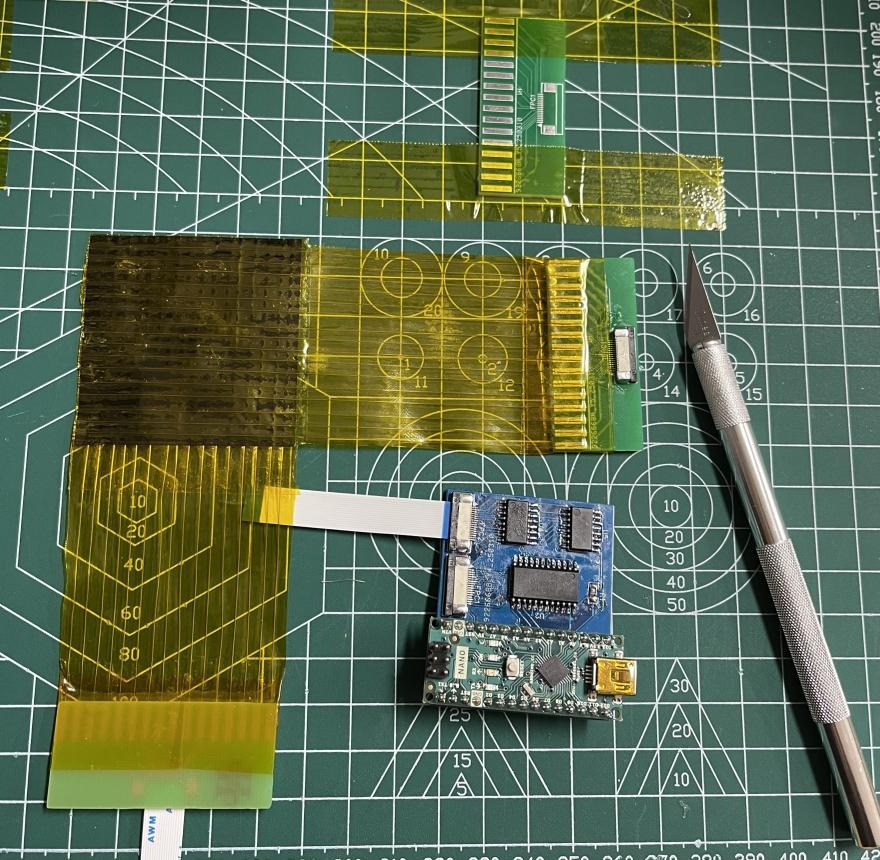
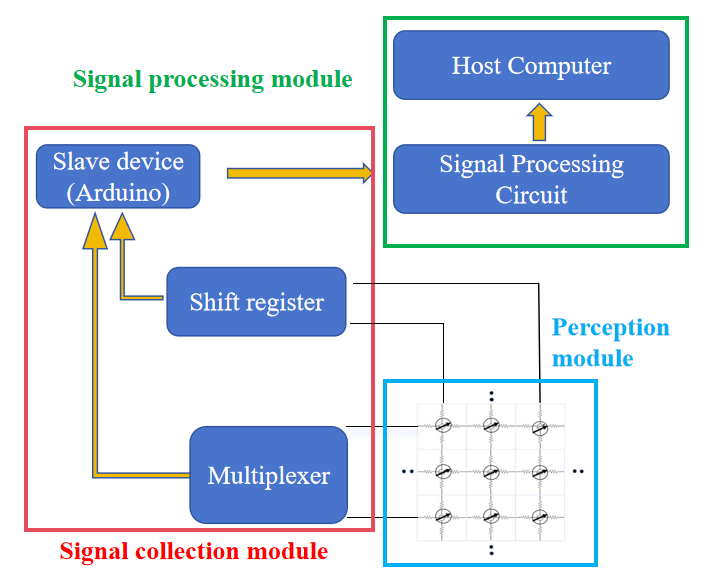
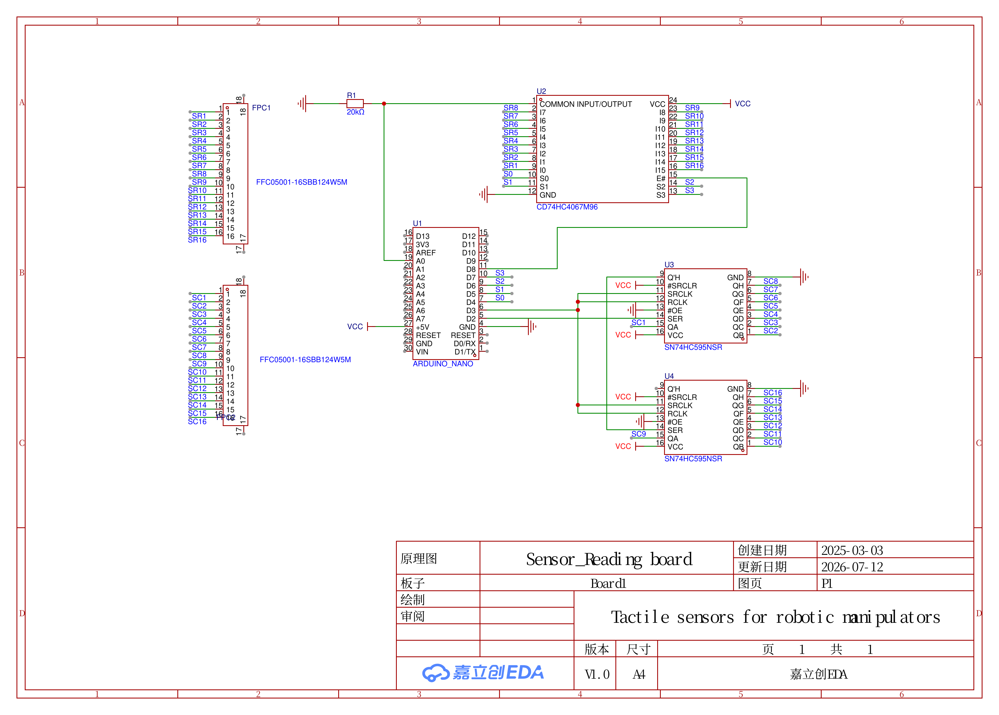
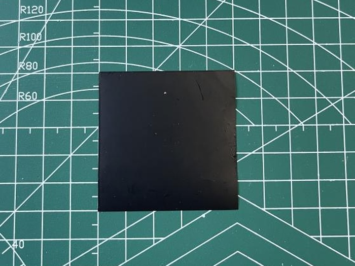
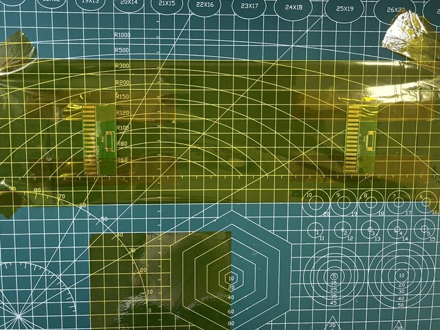
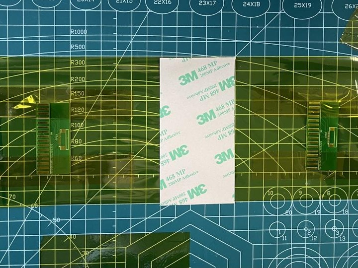
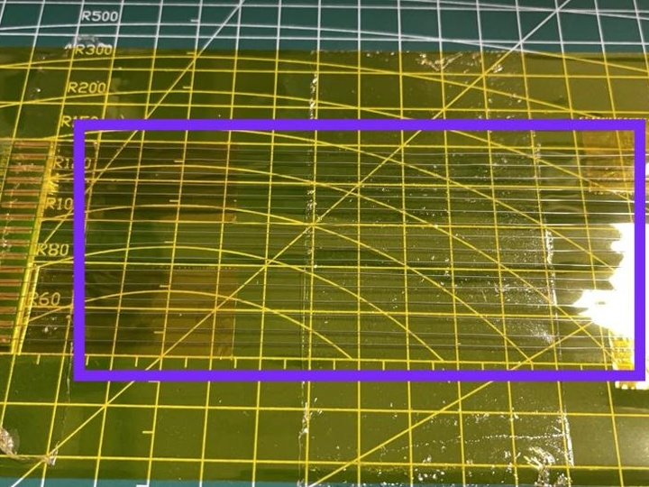
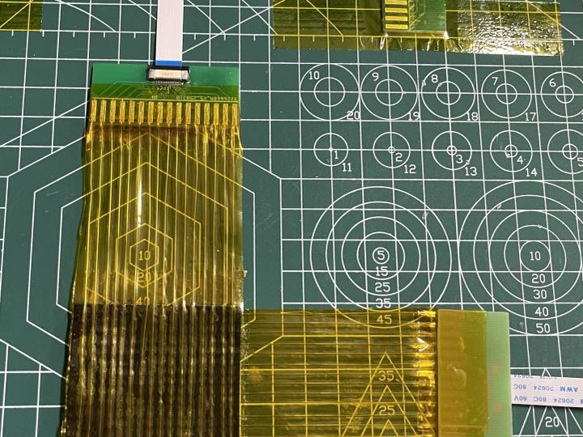
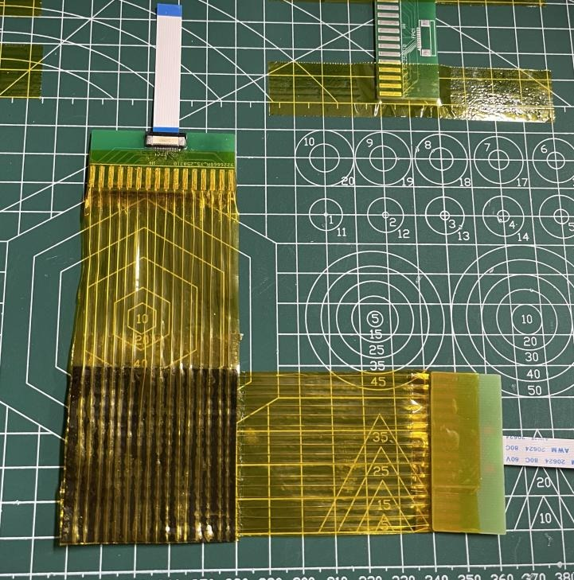
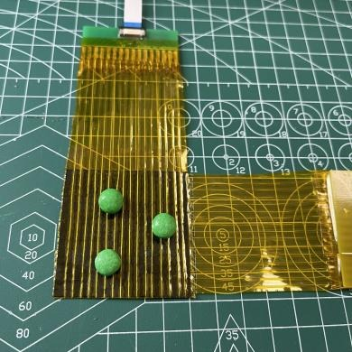

# Tactile Sensors for Robotic Manipulators

**Hardware reproduction, sensor fabrication, and real-time tactile visualization**

<p align="center">
  
</p>

<p align="center">
  <em>Figure 1. Finished 16×16 flexible tactile sensor prototype and Arduino-based readout board.</em>
</p>

## Overview

This repository documents a graduation-project reproduction and experimental adaptation of a low-cost 16×16 flexible piezoresistive tactile sensor. The prototype combines a handmade Velostat sensing matrix, an Arduino-based scanning board, and a Python/OpenCV visualization program.

The reference firmware and reading-board architecture are based on the open-source **3D-ViTac** project by Binghao Huang and collaborators. This repository focuses on the complete engineering workflow: sensor fabrication, hardware integration, schematic redrawing, software adaptation, and bench-top evaluation.

## Project contributions

- Fabricated a handmade 16×16 Velostat tactile array with orthogonal electrodes.
- Integrated the sensor with an Arduino Nano, CD74HC4067 multiplexer, and two SN74HC595 shift registers.
- Redrew and documented the sensor-reading schematic in JLCEDA.
- Organized PCB manufacturing files, BOMs, and pick-and-place data.
- Refactored the Python visualization pipeline with validated frame parsing, configurable ports, simulation mode, and clean shutdown.
- Evaluated baseline response, contact localization, spatial response, and an approximate applied-pressure range.

See [Attribution and scope of contribution](docs/attribution.md) for the distinction between upstream work and project work.

## System architecture

<p align="center">
  
</p>

<p align="center">
  <em>
    Figure 2. System architecture of the tactile sensing platform, including
    the signal collection, perception, and signal-processing modules.
  </em>
</p>

The 16×16 tactile sensor matrix is scanned using two SN74HC595 shift registers
and a CD74HC4067 multiplexer. An Arduino Nano controls the scanning process and
transmits the sampled data to the host computer. The host-side Python program
performs baseline subtraction, thresholding, temporal filtering, and real-time
heatmap visualization.

## Circuit schematic

<p align="center">
  
</p>

<p align="center">
  <em>
    Figure 3. Circuit schematic of the Arduino-based tactile sensor readout board.
  </em>
</p>

The readout circuit consists of an Arduino Nano, one CD74HC4067 analog
multiplexer, and two cascaded SN74HC595 shift registers. The multiplexer selects
one sensor row, while the shift registers control the column-scanning sequence.
The selected taxel voltage is sampled through the Arduino analog input.

The complete schematic is available as a PDF:
[Sensor reading board schematic](hardware/schematics/sensor_reading_board_redrawn.pdf).

## Prototype specifications

<table align="center">
  <tr>
    <th align="center">Item</th>
    <th align="center">Prototype value</th>
  </tr>
  <tr>
    <td align="center">Sensor array</td>
    <td align="center">16 × 16 taxels</td>
  </tr>
  <tr>
    <td align="center">Sensing material</td>
    <td align="center">Velostat</td>
  </tr>
  <tr>
    <td align="center">Target sensor size</td>
    <td align="center">approximately 50 mm × 50 mm</td>
  </tr>
  <tr>
    <td align="center">Electrode pitch</td>
    <td align="center">approximately 3.125 mm</td>
  </tr>
  <tr>
    <td align="center">Microcontroller</td>
    <td align="center">Arduino Nano</td>
  </tr>
  <tr>
    <td align="center">Row selection</td>
    <td align="center">CD74HC4067</td>
  </tr>
  <tr>
    <td align="center">Column selection</td>
    <td align="center">2 × SN74HC595</td>
  </tr>
  <tr>
    <td align="center">ADC transmission</td>
    <td align="center">10-bit ADC reduced to 8-bit values</td>
  </tr>
  <tr>
    <td align="center">Serial baud rate</td>
    <td align="center">2,000,000</td>
  </tr>
  <tr>
    <td align="center">Reported experimental response range</td>
    <td align="center">approximately 7.07–47.88 kPa</td>
  </tr>
  <tr>
    <td align="center">Reported effective spatial response</td>
    <td align="center">approximately 3.6 mm × 3.6 mm</td>
  </tr>
</table>

The last two values are observations under the reported prototype setup, not standardized certification results. See [Experiments](docs/experiments.md) and [Limitations](docs/limitations.md).

## Repository structure

```text
.
├── assets/                       # Project photographs and experiment images
├── docs/                         # Fabrication, experiments, limitations, attribution
├── firmware/                     # Arduino matrix-scanning firmware
├── hardware/
│   ├── bom/                      # Readable BOMs and material list
│   ├── manufacturing/            # Gerber and pick-and-place files
│   └── schematics/               # Redrawn reading-board schematic
├── software/                     # Refactored and legacy Python visualizers
├── tests/                        # Parser and processing tests
└── LICENSES/                     # Upstream license and licensing notes
```

## Fabrication

The sensor was fabricated through the following six steps.

<table align="center">
  <tr>
    <td align="center">
      <br>
      <strong>Step 1.</strong> Cut the Velostat sensing layer.
    </td>
    <td align="center">
      <br>
      <strong>Step 2.</strong> Prepare the polyimide base and electrode interfaces.
    </td>
    <td align="center">
      <br>
      <strong>Step 3.</strong> Apply the adhesive layer for structural fixation.
    </td>
  </tr>
  <tr>
    <td align="center">
      <br>
      <strong>Step 4.</strong> Align the orthogonal electrode array.
    </td>
    <td align="center">
      <br>
      <strong>Step 5.</strong> Laminate and assemble the 16×16 sensor.
    </td>
    <td align="center">
      <br>
      <strong>Step 6.</strong> Connect the finished sensor to the readout board.
    </td>
  </tr>
</table>

A summarized manufacturing procedure is available in [docs/fabrication.md](docs/fabrication.md).

## Quick start

### 1. Upload the firmware

Open `firmware/tactile_sensor_reader.ino` in the Arduino IDE, select the appropriate Arduino Nano board and serial port, and upload it.

The inherited scan sequence has a possible column-alignment issue that should be checked on physical hardware. Read [firmware/README.md](firmware/README.md) before quantitative use.

### 2. Install the visualization software

```bash
python -m venv .venv
# Windows: .venv\Scripts\activate
# Linux/macOS: source .venv/bin/activate
pip install -r software/requirements.txt
```

### 3. Run with the sensor

```bash
python software/tactile_visualizer.py --port COM5
# Linux example:
python software/tactile_visualizer.py --port /dev/ttyUSB0
```

Keep the sensor unloaded during the initial baseline collection.

### 4. Run without hardware

```bash
python software/tactile_visualizer.py --simulate
```

The simulation mode generates a moving synthetic contact pattern, making it possible to verify the software environment without the sensor.


## Experimental examples

<table align="center">
  <tr>
    <td align="center">
      <br>
      <em>Figure 4. Assembled 16×16 tactile sensor.</em>
    </td>
    <td align="center">
      <br>
      <em>Figure 5. Contact test with small objects.</em>
    </td>
    <td align="center">
      <br>
      <em>Figure 6. Real-time tactile heatmap.</em>
    </td>
  </tr>
</table>

The prototype demonstrated real-time contact-distribution visualization in preliminary bench-top experiments. The displayed heatmaps are normalized sensor responses and should not be interpreted as calibrated absolute pressure maps.
Detailed experimental procedures, materials, results, and limitations are available in [docs/experiments.md](docs/experiments.md).

## Known limitations

- Handmade construction causes nonuniform taxel response.
- No complete per-taxel force calibration was performed.
- Hysteresis, repeatability, drift, temperature response, and cycle life require further testing.
- Crosstalk reduction was not validated through a dedicated controlled experiment.
- The current work does not demonstrate closed-loop robotic grasp control.

See [docs/limitations.md](docs/limitations.md) for the planned improvements.

## Acknowledgement

The project builds on the open-source 3D-ViTac tactile sensing implementation. The upstream Arduino copyright and MIT notice are preserved in the firmware and under `LICENSES/`.

## Project status

**Prototype / research reproduction.** The repository is being cleaned and documented for portfolio and reproducibility purposes. Hardware should be verified before fabrication or quantitative measurement.
