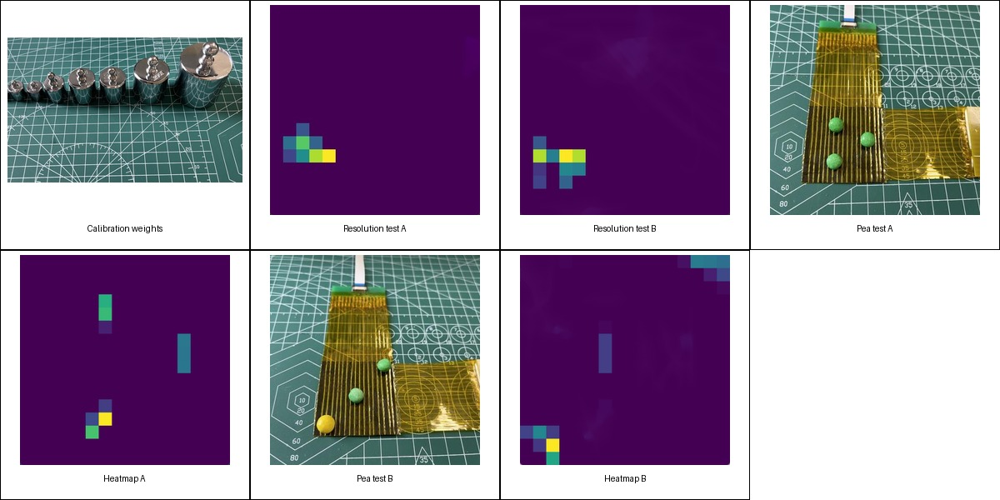

# Experiments

The graduation-project prototype was evaluated with bench-top contact experiments rather than a fully integrated robotic manipulation benchmark.

## Baseline calibration

The host program collected approximately 30 unloaded frames and calculated a per-taxel median baseline. During visualization, the baseline and a fixed threshold were subtracted before clipping and temporal smoothing.

## Spatial-response tests

Cylindrical weights with different contact radii were placed on the sensor. The reported comparison suggested an effective spatial response of approximately 3.6 mm × 3.6 mm under the specific handmade sensor and loading setup.

This value should be interpreted as a prototype observation, not a standardized spatial-resolution certification.

## Applied-pressure range

Under the reported experimental setup, visible heatmap responses were observed from approximately 7.07 kPa to 47.88 kPa. The values were calculated from applied load and nominal contact area.

The software visualized normalized ADC response. It did not perform a per-taxel calibrated conversion from ADC value to pressure, so the heatmap should not be read as an absolute pressure map.

## Small-object contact tests

Small objects were placed at multiple positions on the sensing surface. The displayed activation pattern roughly matched the contact locations and demonstrated real-time contact-distribution visualization.

| Physical contact | Heatmap |
|---|---|
|  |  |
|  |  |

## Claims intentionally not made

The current evidence does not establish industrial certification, calibrated force reconstruction, long-term durability, or statistically validated crosstalk suppression.
