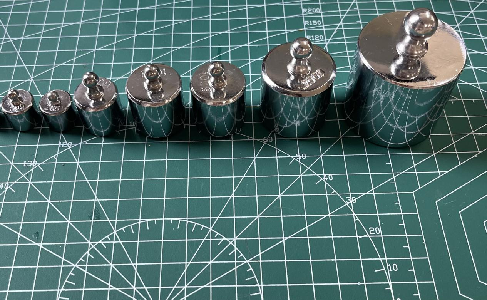
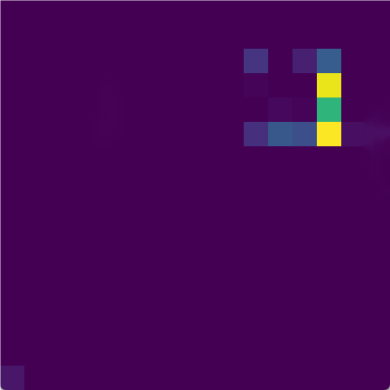
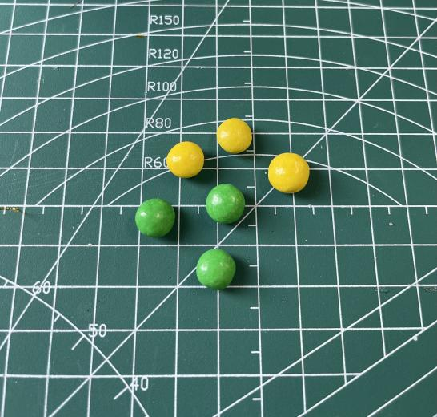
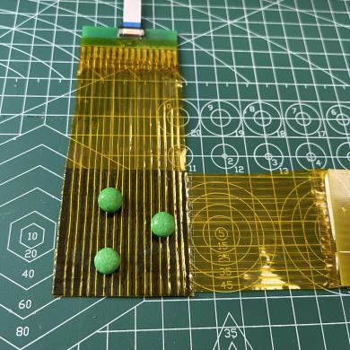
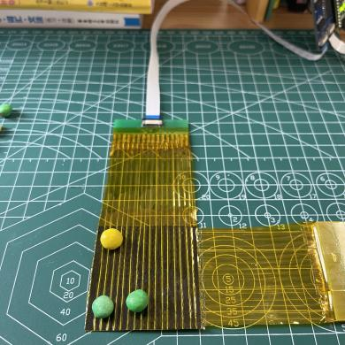
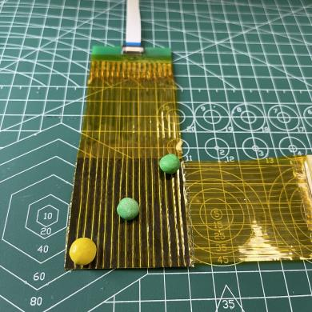

# Experiments

The prototype was evaluated through bench-top experiments designed to examine
its spatial response, approximate measurement range, filtering behavior, and
ability to visualize contact distributions from small objects.

These experiments were performed on the handmade prototype and should be
interpreted as preliminary engineering evaluations rather than standardized
sensor certification tests.

---

## Experimental equipment and materials

The following equipment and materials were used:

- 16×16 flexible Velostat tactile sensor
- Arduino Nano and sensor readout board
- Python/OpenCV visualization program
- Cylindrical calibration weights with different radii
- Additional calibrated loads for applying known normal forces
- Small peas used as irregular contact objects
- Flat loading plate for distributing pressure during the pea tests

  

  <em>
    Figure 1. Cylindrical calibration weights used to apply controlled
    normal forces and different contact areas.
  </em>

---

## 1. Spatial-response experiment

### Materials

- Cylindrical weight with radius \(R = 0.6\) cm
- Cylindrical weight with radius \(R = 0.8\) cm
- Cylindrical weight with radius \(R = 1.1\) cm
- Cylindrical weight with radius \(R = 1.475\) cm
- Applied loads of 1.5 N and 4 N
- Real-time tactile heatmap program

### Procedure

Two groups of cylindrical weights were compared.

In the first group, weights with radii of 0.6 cm and 0.8 cm were each loaded
with 1.5 N. Their centers were aligned with the same location on the sensor.

In the second group, weights with radii of 1.1 cm and 1.475 cm were each loaded
with 4 N. The resulting heatmap boundaries were compared to determine whether
the sensor could distinguish changes in contact size.

### Results: 0.6 cm and 0.8 cm radii

<table align="center">
  <tr>
    <td align="center">
       
      <em>Figure 2a. Radius 0.6 cm, applied force 1.5 N.</em>
    </td>
    <td align="center">
       
      <em>Figure 2b. Radius 0.8 cm, applied force 1.5 N.</em>
    </td>
  </tr>
</table>

### Results: 1.1 cm and 1.475 cm radii

<table align="center">
  <tr>
    <td align="center">
       
      <em>Figure 3a. Radius 1.1 cm, applied force 4 N.</em>
    </td>
    <td align="center">
       
      <em>Figure 3b. Radius 1.475 cm, applied force 4 N.</em>
    </td>
  </tr>
</table>

### Observation

When the contact boundary increased by approximately 0.2 cm, no clear change
was observed in the heatmap boundary. When the increase reached approximately
0.4 cm, the activated boundary expanded by roughly one sensor unit.

Under this experimental setup, the effective spatial response was estimated
to be approximately:

\[
3.6\ \text{mm} \times 3.6\ \text{mm}
\]

This value is a prototype-level observation and not a standardized spatial
resolution certification.

---

## 2. Approximate measurement-range experiment

### Materials

- Cylindrical weight with radius \(R = 0.6\) cm
- Cylindrical weight with radius \(R = 1.1\) cm
- Incrementally applied normal loads
- Real-time tactile heatmap program

### Procedure

The applied force was gradually increased while monitoring the heatmap.

The smaller 0.6 cm-radius weight was used to examine the minimum detectable
pressure. The larger 1.1 cm-radius weight was used to observe the response at
higher loads and to estimate the upper useful range.

### 2.1 Minimum detectable response

The following forces were tested with the 0.6 cm-radius weight:

- 0.5 N: no visible response
- 0.7 N: no visible response
- 0.8 N: visible blue pixels
- 0.85 N: visible response
- 0.95 N: visible response
- 1.0 N: visible response

<table align="center">
  <tr>
    <td align="center">
       
      <em>0.5–0.7 N</em>
    </td>
    <td align="center">
       
      <em>0.8 N</em>
    </td>
    <td align="center">
       
      <em>0.85 N</em>
    </td>
  </tr>
  <tr>
    <td align="center">
       
      <em>0.95 N</em>
    </td>
    <td align="center">
       
      <em>1.0 N</em>
    </td>
  </tr>
</table>

Repeated trials between 0.7 N and 0.8 N suggested that approximately 0.8 N
was the minimum load that produced a visible heatmap response.

Using the nominal contact area of the 0.6 cm-radius weight, this corresponds
to approximately:

\[
7.07\ \text{kPa}
\]

### 2.2 Intermediate-force response

The 1.1 cm-radius weight was tested at 2 N, 4 N, 6 N, and 8 N.

<table align="center">
  <tr>
    <td align="center">
       
      <em>Figure 4a. 2 N.</em>
    </td>
    <td align="center">
       
      <em>Figure 4b. 4 N.</em>
    </td>
    <td align="center">
       
      <em>Figure 4c. 6 N.</em>
    </td>
    <td align="center">
       
      <em>Figure 4d. 8 N.</em>
    </td>
  </tr>
</table>

As the load increased, the activated area became more complete and the
heatmap intensity increased.

### 2.3 Upper-range observation

Additional loads between approximately 12 N and 19 N were tested.

<table align="center">
  <tr>
    <td align="center">
      
    </td>
    <td align="center">
      
    </td>
    <td align="center">
      
    </td>
    <td align="center">
      
    </td>
  </tr>
</table>

The heatmap showed little additional change between approximately 18 N and
19 N. Repeated tests suggested an upper useful load of approximately 18.2 N.

Using the nominal contact area of the 1.1 cm-radius weight, this corresponds
to approximately:

\[
47.88\ \text{kPa}
\]

Therefore, the observed prototype response range under the reported setup was
approximately:

\[
7.07\text{–}47.88\ \text{kPa}
\]

The heatmaps represent normalized ADC responses. They are not calibrated
absolute-pressure maps.

---

## 3. Filtering assessment

### Materials and conditions

- Cylindrical weight with radius \(R = 0.6\) cm
- Applied load of approximately 1 N
- Approximate nominal pressure of 8.84 kPa
- Contact area covering approximately a 4×4 taxel region
- Original visualization pipeline
- Kalman-filtered comparison pipeline

### Procedure

The same contact condition was processed both with and without Kalman
filtering. The visual stability, spatial noise, and processing latency were
compared.

### Results

- The Kalman filter approximately doubled the processing latency.
- No clear spatial-noise reduction was observed under the tested condition.
- Temporal transitions became smoother.
- The improvement was not considered sufficient to justify the latency cost.

For this reason, Kalman filtering was not retained in the final prototype
pipeline. The final implementation instead used baseline subtraction and
exponential temporal smoothing.

---

## 4. Small-object contact experiment

### Materials

- Three small peas
- Finished 16×16 tactile sensor
- Flat loading plate
- Calibrated load of approximately 1.5 N
- Python/OpenCV real-time heatmap program

  

  <em>Figure 5. Small peas used as irregular contact objects.</em>

### Procedure

Three peas were randomly placed at different positions on the sensor surface.
A flat loading plate was placed above them, and a calibrated normal load of
approximately 1.5 N was applied to create distributed contact.

The physical pea locations were then compared with the activated regions in
the real-time tactile heatmap.

### Trial 1

<table align="center">
  <tr>
    <td align="center">
       
      <em>Physical contact arrangement</em>
    </td>
    <td align="center">
       
      <em>Corresponding heatmap</em>
    </td>
  </tr>
</table>

### Trial 2

<table align="center">
  <tr>
    <td align="center">
       
      <em>Physical contact arrangement</em>
    </td>
    <td align="center">
       
      <em>Corresponding heatmap</em>
    </td>
  </tr>
</table>

### Trial 3

<table align="center">
  <tr>
    <td align="center">
       
      <em>Physical contact arrangement</em>
    </td>
    <td align="center">
       
      <em>Corresponding heatmap</em>
    </td>
  </tr>
</table>

### Observation

The principal activated regions approximately corresponded to the physical
locations of the peas. This experiment demonstrated that the prototype could
visualize distributed contact locations in real time.

It did not demonstrate calibrated force reconstruction or robotic closed-loop
grasp control.

---

## Experimental limitations

The experiments presented here have several limitations:

- The sensor was handmade, leading to nonuniform taxel sensitivity.
- Pressure was estimated from applied load and nominal contact area.
- No complete per-taxel force calibration was performed.
- The heatmaps display normalized ADC response rather than absolute pressure.
- Repeatability, hysteresis, drift, temperature response, and cycle life were
  not systematically evaluated.
- The experiments were bench-top demonstrations rather than robotic grasping
  benchmarks.
