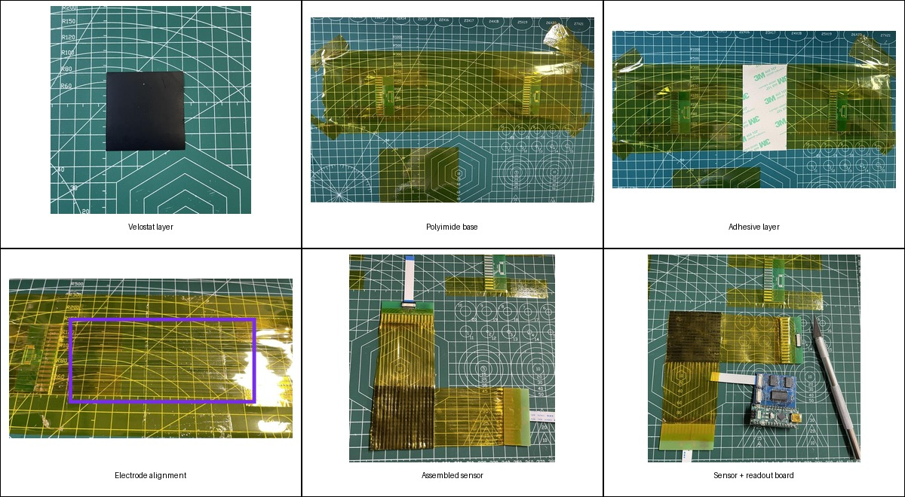

# Sensor fabrication

The sensing sheet is a handmade 16×16 piezoresistive matrix with orthogonal row and column electrodes separated by a Velostat layer.

## Prototype process

1. Cut a roughly 50 mm × 50 mm Velostat sensing layer.
2. Fix a polyimide sheet to the work surface with the adhesive side facing upward.
3. Apply 3M 468MP adhesive transfer tape over the intended sensing area.
4. Align 16 parallel conductive electrodes using the connector pitch as a guide.
5. Place the Velostat layer over the first electrode layer and press it flat.
6. Fabricate a second electrode sheet in the same way, rotated by 90 degrees.
7. Bond the two sheets to form the row-Velostat-column sandwich.
8. Connect the row and column tails to the readout and connector boards.

## Geometry reported for the prototype

- Array: 16 × 16 taxels
- Overall target size: approximately 50 mm × 50 mm
- Electrode center spacing: approximately 3.125 mm
- Sensing mechanism: pressure-dependent resistance of Velostat

## Practical cautions

- Nonuniform electrode tension changes the contact resistance across the array.
- Adhesive thickness and local wrinkles influence sensitivity and repeatability.
- Row/column alignment should be checked before final bonding.
- The handmade process is suitable for a prototype, not yet for reproducible batch fabrication.
