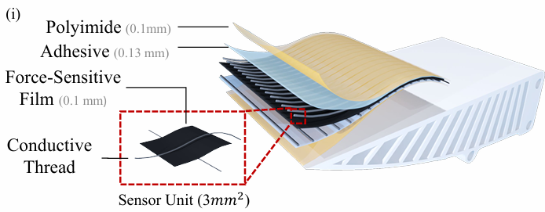
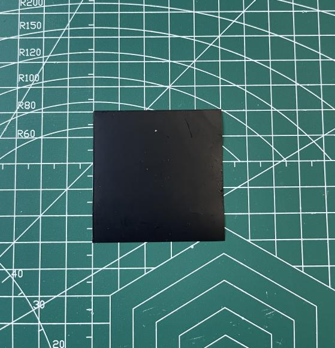
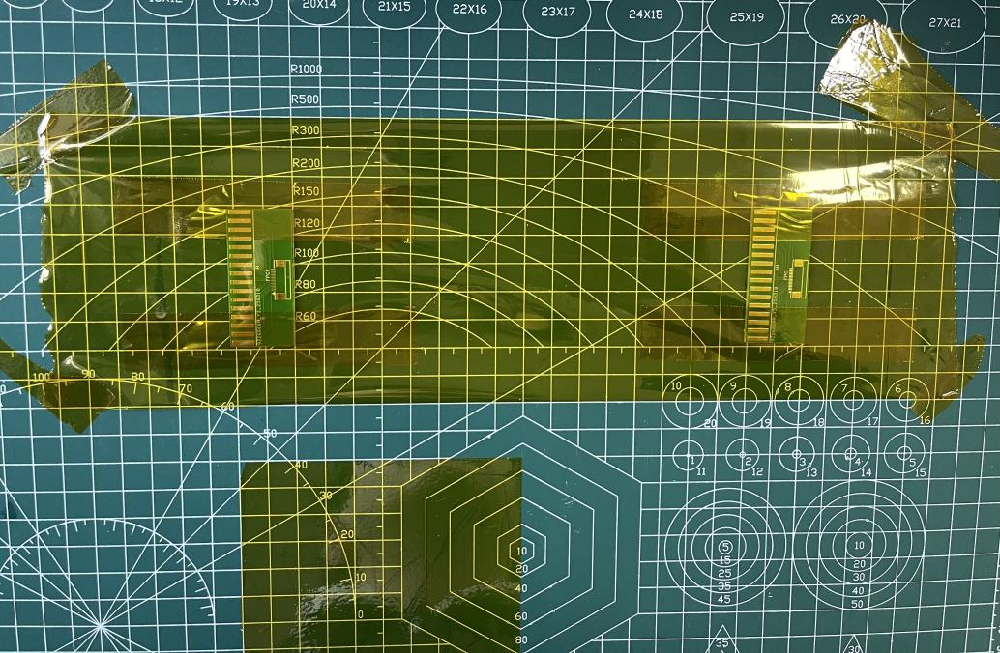
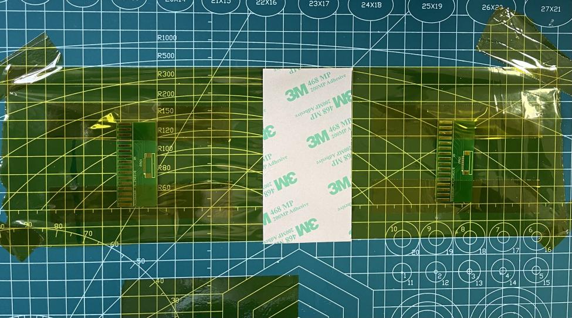
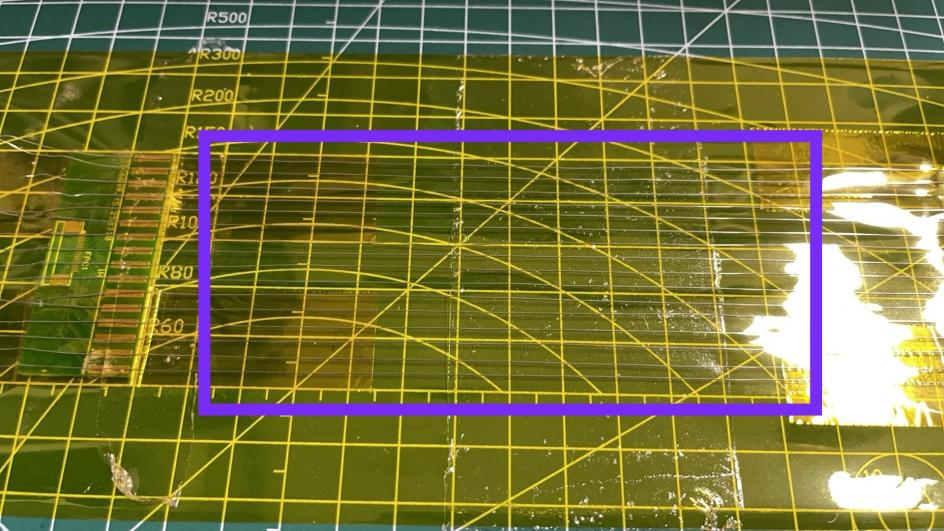
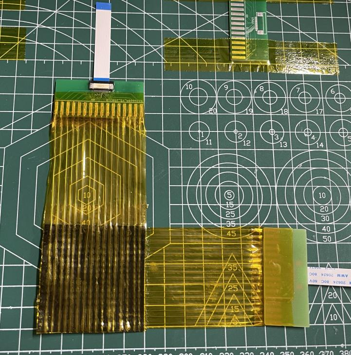
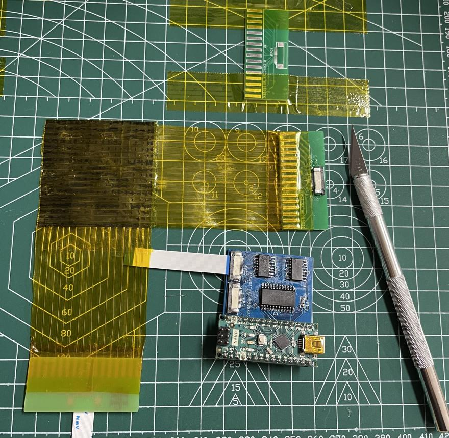

# Sensor fabrication

The tactile sensing sheet is a handmade 16×16 piezoresistive matrix fabricated
from flexible materials and connected to an external readout board.

This page summarizes the fabrication materials, the layered sensor structure,
and the main assembly steps used in the graduation-project prototype.

---

## Materials

The following materials were used for the sensor body:

- Velostat sheet as the piezoresistive sensing layer
- Polyimide film as the flexible substrate
- Conductive electrodes arranged in orthogonal row and column directions
- Adhesive layer for structural fixation
- Flexible connector tabs for interfacing with the readout board
- External sensor-reading PCB and Arduino Nano for data acquisition

---

## Layered sensor structure

The sensor consists of stacked flexible layers. The Velostat sheet is sandwiched
between orthogonal row and column electrodes so that local pressure changes the
contact resistance at each intersection.

  

  <em>
    Figure 1. Conceptual layered structure of the handmade flexible tactile sensor.
  </em>

---

## Fabrication procedure

The prototype was fabricated through the following steps.

### Step 1. Prepare the Velostat sensing layer

A square Velostat sheet was cut to the target sensing size and used as the
piezoresistive core layer of the tactile sensor.

  

  <em>Figure 2. Cut Velostat sensing layer.</em>

### Step 2. Prepare the polyimide base

A polyimide base layer was prepared to support the flexible electrode structure
and the connector interfaces.

  

  <em>Figure 3. Polyimide base and flexible electrode interface area.</em>

### Step 3. Apply the adhesive layer

An adhesive layer was added to mechanically stabilize the sensor stack and
maintain alignment between the functional layers.

  

  <em>Figure 4. Adhesive layer used for structural fixation.</em>

### Step 4. Align the electrode array

The row and column electrodes were arranged orthogonally. Their overlap defined
the 16×16 taxel matrix.

  

  <em>
    Figure 5. Electrode alignment before final lamination of the tactile matrix.
  </em>

### Step 5. Assemble the tactile sensor

After the layers were aligned, the complete flexible sensor was laminated into
a finished 16×16 tactile array with connector tabs for readout.

  

  <em>Figure 6. Finished 16×16 flexible tactile sensor.</em>

### Step 6. Connect the sensor to the readout board

The completed sensor was connected to the external readout system consisting of
the sensor-reading board and Arduino Nano.

  

  <em>
    Figure 7. Finished sensor connected to the Arduino-based readout board.
  </em>

---

## Final prototype

The final prototype combines the handmade flexible sensing sheet with the
external scanning and acquisition hardware. This configuration was then used
for the pressure-range, spatial-response, and small-object contact experiments
described in [experiments.md](experiments.md).

---

## Notes and limitations

- The sensor was handmade, so taxel uniformity is limited.
- Alignment accuracy directly affects sensitivity consistency.
- The fabrication process emphasizes low cost and ease of prototyping rather
  than industrial manufacturing precision.
- The current repository documents the prototype fabrication workflow rather
  than a mass-production-ready process.
